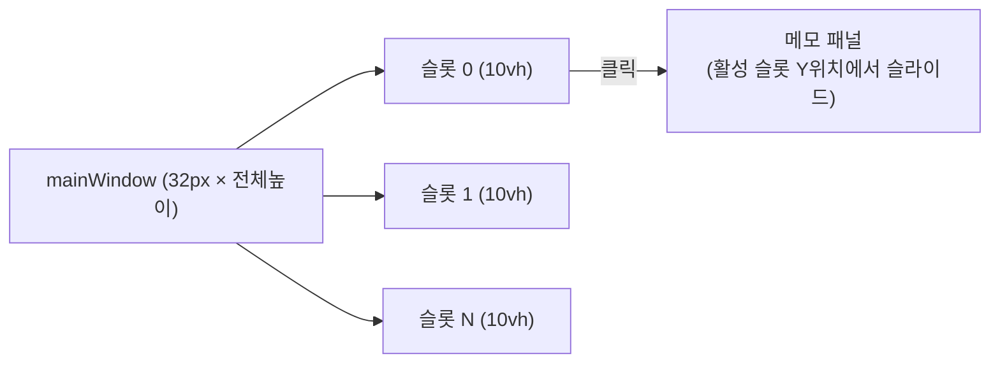

# 빼꼼 플러스 빌드 플랜

## 변경 대상 파일

- [`main.js`](main.js) — 창 아키텍처 개편 + 내보내기 IPC 추가
- [`index.html`](index.html) — 손잡이 재설계, 마크다운, 폰트 크기, 10슬롯, 커스텀 테마, 클릭통과
- [`settings.html`](settings.html) — 10슬롯, 커스텀 테마 컬러피커, 내보내기 섹션
- [`package.json`](package.json) — `marked` 의존성 추가, `dist:plus` 스크립트 추가

## 새로 생성할 파일

- `electron-builder-plus.json` — 플러스 전용 빌드 설정

---

## 기능별 구현 계획

### 1. 전체 높이 투명 배너 + 손잡이 독립 위치 조절

**현재 구조** → mainWindow가 ~460px 높이, 위치 단위로 이동
**새 구조** → mainWindow가 모니터 전체 높이, 손잡이는 10등분 슬롯에 독립 배치



**main.js 변경**
- `getWindowDimensions()`: 높이를 `display.bounds.height`로 고정, 폭은 접힘/펼침 토글
- `computeAnchoredY()`: 항상 `display.bounds.y` 반환 (전체 높이 고정이므로 Y 이동 불필요)
- `refreshWindowPosition()`: 높이 변경 없이 x만 조정

**index.html 변경**
- `--handle-height: 10vh` (CSS 변수, 모니터 높이의 1/10 고정)
- 각 슬롯에 `ySlot` (0-9) 저장 → `top: calc(var(--handle-height) * ySlot)`으로 절대 배치
- 드래그: 세로 드래그 시 `ySlot` 변경 (픽셀 → 슬롯 인덱스 환산)
- 스냅: 다른 손잡이의 슬롯에 진입하면 400ms 후 슬롯 교환 (기존 `swapTimer` 로직 활용)
- 손잡이 모양: `border-radius: 12px 0 0 12px` (좌측 위아래 동일 라운드)
- `note-shell`: `top: calc(var(--handle-height) * activeYSlot)` + 최대 높이 `calc(10 * var(--handle-height))` (화면 넘치지 않도록 `clamp`)

**상태(state) 변경**
- 버전 v3 → v4, 상태 키 `ppaekkom-plus-state-v4`
- `slots[i].ySlot` 추가 (기본값: i번째 슬롯 = i번 위치)
- v3 마이그레이션 지원

---

### 2. 슬롯 최대 10개

- `MAX_SLOTS = 10` (기존 3)
- `createFreshState()`: `slots` 배열 10개
- `settings.html`: `enabledCount < 10` 조건으로 + 버튼 표시, `refreshSlotMemosFromDisk()` 10개 처리
- 슬롯 삭제 시 shift 로직을 10개 기준으로 수정

---

### 3. 글자 크기 조절

- `slots[i].fontSize` 추가 (기본값: 18)
- **Ctrl+Wheel**: `index.html`에 `wheel` 이벤트 리스너, `ctrlKey` 감지 시 ±1px (8~36 클램프)
- **서식 바 버튼**: `A-` / `A+` 버튼 2개 추가 → `memoEditor.style.fontSize` 갱신 + 상태 저장
- `main.js`의 `before-input-event` Ctrl+휠 차단 로직 제거 (렌더러에서 처리)

---

### 4. 마크다운 WYSIWYG

`npm install marked` 로 의존성 추가 후 `require('marked')` 사용

- `input` 이벤트에서 현재 커서가 있는 줄의 텍스트를 검사
- 줄 앞에 `# ` → `<h1>`, `## ` → `<h2>`, `### ` → `<h3>` 변환 (Enter 입력 시)
- `**text**` / `*text*` → `<strong>` / `<em>` 변환 (구분자 완성 시)
- `- ` 로 시작하는 줄 → `<ul><li>` 자동 변환
- 커서 위치 보존은 기존 `getCaretCharOffset` / `setCaretByCharOffset` 재활용

---

### 5. 설정창 내보내기 (.txt / .md / .json)

**settings.html** 공통 패널에 내보내기 섹션 추가:
```
[현재 인덱스 .txt] [현재 인덱스 .md] [전체 내보내기 .json]
```

**main.js** 새 IPC 핸들러 추가:
```
ipcMain.handle("export:save", (_, { format, content, defaultName })
  → dialog.showSaveDialog → fs.writeFile
```

- `.txt`: `memoHtml`에서 HTML 태그 제거한 plain text
- `.md`: `memoHtml`을 마크다운으로 역변환 (기본 태그만: `<strong>→**`, `<em>→*`, `<h1>→#` 등)
- `.json`: 전체 `appState` JSON

---

### 6. 테마 커스터마이징 (컬러피커)

- `THEME_NAMES`에 `"custom"` 추가
- `slots[i].customBg`, `slots[i].customText` 저장
- `settings.html` 인덱스 패널: 테마 버튼에 "커스텀" 추가 + `<input type="color">` 두 개 (배경색/글자색) → `"custom"` 선택 시 표시
- `THEME_MAP.custom`: `slots[i].customBg`, `slots[i].customText`를 실시간 반영

---

### 7. 클릭 통과 오류 원천 차단

전체 높이 오버레이에서 발생하는 두 가지 문제 모두 해결:

**A. 투명 배너가 클릭 차단 문제** (`setIgnoreMouseEvents`)
- 창 전체에 기본 `setIgnoreMouseEvents(true, { forward: true })` 적용
- 손잡이 위에 커서가 있을 때만 `setIgnoreMouseEvents(false)`
- 기존 `refreshPointerHitTest` 로직을 전체 높이 기준으로 재보정

**B. 패널 열렸을 때 아래 앱 입력 차단 문제**
- 메모 패널 영역(`note-shell`)만 `pointer-events: auto`, 나머지 투명 영역은 `pointer-events: none`
- `syncWindowInteraction`의 `ignoreMouse` 판단을 히트테스트 결과 기반으로 유지 (기존 로직 활용)

---

## 빌드 전략

`electron-builder-plus.json` 생성:
```json
{
  "appId": "com.ppaekkom.plus",
  "productName": "빼꼼 플러스",
  "extends": null,
  "win": {
    "artifactName": "빼꼼 플러스-Setup.${ext}"
  },
  "nsis": {
    "shortcutName": "빼꼼 플러스"
  },
  "directories": { "output": "dist" }
}
```

`package.json`에 스크립트 추가:
```json
"dist:plus": "electron-builder --config electron-builder-plus.json --win nsis"
```

빌드 명령: `npm run dist:plus`